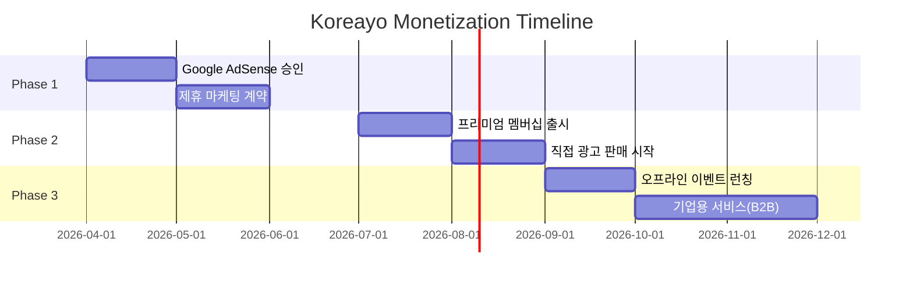

# Koreayo Platform Expansion Strategy (CMO Perspective)

**작성일**: 2026-04-21
**작성자**: Koreayo CMO
**목적**: WordPress 블로그에서 외국인 커뮤니티 플랫폼으로 확장

---

## Executive Summary

Koreayo.com을 단순 정보 블로그에서 **외국인 커뮤니티 플랫폼**으로 전환하여:
1. 사용자 참여도 300% 증가 (6개월 목표)
2. MAU (Monthly Active Users) 10,000명 달성 (12개월 목표)
3. 다양한 수익화 모델 구축 (광고 + 프리미엄 + 파트너십)
4. 모바일 퍼스트 UX 완성

---

## Phase 1: Foundation (0-3개월) - 블로그 강화

### 1.1 콘텐츠 마케팅 강화

#### 목표
- Google 검색 상위 노출 (타겟 키워드 50개)
- 월간 방문자 5,000명 → 15,000명
- 평균 체류시간 2분 → 4분

#### 실행 전략

**A. SEO 최적화 완성**
```markdown
우선순위 키워드 (영어):
- visa extension korea
- alien registration card
- korea apartment deposit
- korean bank account foreigner
- korea health insurance

우선순위 키워드 (한국어):
- 외국인 비자 연장
- 외국인 등록증
- 전세 보증금 반환
```

**B. 콘텐츠 시리즈 기획**
```
시리즈 1: "First 30 Days in Korea" (신규 입국자)
- Day 1-7: 필수 행정 절차
- Day 8-14: 주거 및 은행
- Day 15-30: 생활 인프라 구축

시리즈 2: "Visa Type Guides" (비자별 가이드)
- E-2 Teaching Visa Complete Guide
- F-2 Dependent Visa Handbook
- D-10 Job Seeker Visa Checklist

시리즈 3: "Korean Life Hacks" (생활 팁)
- 배달앱 완전정복
- 공공요금 절약법
- 병원 이용 가이드
```

**C. 콘텐츠 배포 채널 확대**
```
1차 채널 (Owned Media):
- koreayo.com 블로그
- Google 검색
- Naver 블로그 (한국어 SEO)

2차 채널 (Earned Media):
- Reddit r/Living_in_Korea (콘텐츠 공유)
- Facebook Groups (Korea Expat 그룹)
- LinkedIn (전문직 외국인 타겟)

3차 채널 (Social Media - 향후 개설):
- Instagram: @koreayo.official
- YouTube: Koreayo Channel (비디오 가이드)
- TikTok: @koreayo (숏폼 팁)
```

### 1.2 이메일 마케팅 시작

**목표**: 뉴스레터 구독자 1,000명 (3개월)

**전략**:
```
리드 마그넷:
- "The Ultimate Korea Arrival Checklist" (PDF)
- "50 Korean Phrases Every Foreigner Should Know"
- "Korea Expat Survival Kit" (체크리스트 + 템플릿)

뉴스레터 구조:
- 주간 발송 (매주 월요일 오전 9시)
- 섹션 1: 이번 주 신규 가이드 (1개)
- 섹션 2: 커뮤니티 Q&A 하이라이트
- 섹션 3: 공식 업데이트 (비자 정책 변경 등)
- 섹션 4: 독자 사연 (User Story)
```

### 1.3 커뮤니티 시드 생성

**목표**: 초기 활성 사용자 50명 확보

**전략**:
```
베타 테스터 모집:
1. 기존 블로그 댓글 참여자 초대
2. Facebook/Reddit 그룹에서 모집
3. 영어학원 강사, 대학원생 등 타겟 접근

인센티브:
- "Founding Member" 뱃지
- 프리미엄 기능 평생 무료
- 콘텐츠 제작 참여 기회 (Co-creation)
```

---

## Phase 2: Community Launch (3-6개월) - 플랫폼 전환

### 2.1 핵심 커뮤니티 기능 추가

#### 기능 우선순위 (CTO 협의 필요)

**Priority 1 (Must Have)**:
```
1. Q&A 포럼
   - 카테고리: Visa / Housing / Banking / Healthcare / Daily Life
   - 투표 기능 (Best Answer)
   - 태그 시스템 (#e2visa #deposit #hikorea)

2. 사용자 프로필
   - 기본 정보 (국적, 비자 타입, 거주 지역)
   - 기여도 점수 (Karma 시스템)
   - 뱃지/배지 (Contributor, Expert, Helper)

3. 알림 시스템
   - 댓글/답글 알림
   - 관심 주제 업데이트
   - 중요 정책 변경 알림
```

**Priority 2 (Should Have)**:
```
4. 실시간 채팅 (또는 Discord 통합)
   - 긴급 질문 채널
   - 지역별 채팅방 (Seoul, Busan, etc.)
   - 언어별 채팅방 (English, 中文, 日本語)

5. 이벤트 캘린더
   - 비자 만료일 리마인더
   - 공휴일/행정일정 공유
   - 오프라인 밋업 공지

6. 리소스 라이브러리
   - 다운로드 가능한 템플릿 (서류 양식)
   - 체크리스트 (이사, 비자 연장 등)
   - 공식 링크 모음
```

**Priority 3 (Nice to Have)**:
```
7. 마켓플레이스
   - 중고 거래 (가구, 전자제품)
   - 룸메이트 찾기
   - 서비스 교환 (한국어-영어 교환 등)

8. 멘토링 시스템
   - 신규 입국자 ↔ 장기 거주자 매칭
   - 1:1 상담 예약
```

### 2.2 모바일 최적화 전략

#### 현재 문제점
- GeneratePress 기본 테마는 데스크톱 중심
- 블로그 레이아웃은 모바일에서 가독성 낮음
- 커뮤니티 기능 추가 시 모바일 UX 필수

#### 해결 방안 (CTO 협의 필요)

**Option A: Progressive Web App (PWA) 전환**
```
장점:
- 네이티브 앱 느낌
- 설치 가능 (홈 화면 추가)
- 오프라인 접근 가능
- 푸시 알림 지원

단점:
- 개발 리소스 필요
- iOS Safari 제한 사항

기술 스택 제안:
- WordPress Headless CMS (백엔드)
- Next.js + React (프론트엔드)
- Tailwind CSS (스타일링)
```

**Option B: 모바일 최적화 WordPress 테마**
```
장점:
- 빠른 구현 (2-4주)
- 기존 콘텐츠 유지
- 플러그인 호환성

단점:
- 커뮤니티 기능 제한적
- 속도 최적화 한계

추천 테마/프레임워크:
- BuddyPress (커뮤니티 플러그인)
- bbPress (포럼)
- 커스텀 모바일 테마 개발
```

**Option C: Hybrid (추천)**
```
1단계: WordPress + BuddyPress (3-6개월)
   - 빠르게 커뮤니티 기능 추가
   - 모바일 반응형 테마 적용

2단계: PWA 마이그레이션 (6-12개월)
   - 사용자 피드백 반영
   - 점진적 전환
```

### 2.3 Growth Hacking 전략

#### 바이럴 루프 설계

**Referral Program**:
```
구조:
- 친구 초대 → 양쪽 모두 보상
- 보상: 프리미엄 기능 1개월 무료

추천 보상 예시:
- 3명 초대 → "Top Contributor" 뱃지
- 10명 초대 → 오프라인 이벤트 무료 참가
- 50명 초대 → Koreayo 공식 앰배서더
```

**Content Virality Tactics**:
```
1. 인포그래픽 제작
   - "Korea Visa Process Flowchart"
   - "Cost of Living in Seoul vs Busan"
   → Pinterest, Instagram 공유 최적화

2. 데이터 기반 콘텐츠
   - "2026 Korea Expat Survey Results"
   - "Top 10 Housing Complaints by Foreigners"
   → 언론 보도 유도

3. UGC (User Generated Content) 장려
   - "Share Your Korea Story" 캠페인
   - 월간 베스트 스토리 선정 + 상품
```

#### SEO 확장

**롱테일 키워드 공략**:
```python
# 예시 키워드 확장 전략
Base Keyword: "korea visa"

Expanded Long-tail:
- "how to extend e2 visa korea"
- "korea f2 visa requirements 2026"
- "can i change visa type in korea"
- "korea visa overstay penalty"
- "korea student visa part time work hours"

Target: 500개 롱테일 키워드 (12개월)
```

**Google Featured Snippets 타겟팅**:
```markdown
전략:
1. "How to..." 질문형 콘텐츠 작성
2. 단계별 구조 (Numbered Lists)
3. 요약 박스 (첫 100단어에 답변)

예시 타겟팅:
- "How to extend visa in Korea?" → 스텝바이스텝 가이드
- "What documents needed for ARC?" → 체크리스트 형식
```

---

## Phase 3: Monetization (6-12개월) - 수익화

### 3.1 다층 수익 모델

#### Revenue Stream 1: 광고 (Advertising)

**Google AdSense (기본)**:
```
예상 수익:
- 월 방문자 50,000명
- 페이지뷰 150,000 (RPM $3-5)
- 월 수익: $450-750 (₩600,000-1,000,000)

최적화 전략:
- 콘텐츠 내 네이티브 광고 배치
- 사이드바 디스플레이 광고
- 모바일 앵커 광고
```

**직접 광고 판매 (Direct Deals)**:
```
타겟 광고주:
1. 부동산 중개 (외국인 전문)
2. 이민 법무사 / 비자 컨설팅
3. 어학원 / 튜터링 서비스
4. 이사 서비스 / 가구 렌탈
5. SIM 카드 / 통신사 (외국인 요금제)
6. 보험사 (외국인 보험)

가격 모델:
- 배너 광고: ₩500,000/월
- 스폰서 콘텐츠: ₩1,000,000/건
- 뉴스레터 광고: ₩300,000/회
```

#### Revenue Stream 2: 프리미엄 멤버십

**Freemium 모델**:
```
Free Tier (무료):
- 모든 블로그 콘텐츠 접근
- Q&A 포럼 읽기/쓰기
- 기본 프로필 기능

Premium Tier (₩9,900/월 or ₩99,000/년):
- 광고 제거
- 프리미엄 가이드 (심층 콘텐츠)
- 우선 답변 (Expert 답변 보장)
- 오프라인 이벤트 할인
- 다운로드 가능한 템플릿 무제한
- 1:1 멘토링 매칭 우선권

Pro Tier (₩29,900/월) - B2B 타겟:
- 기업용 가이드 (채용, HR 정책)
- 다중 사용자 계정
- 커스텀 컨설팅
- API 접근 (데이터 활용)
```

**수익 예측**:
```
목표 (12개월):
- MAU: 10,000명
- 전환율: 3%
- 프리미엄 구독자: 300명
- 월 수익: ₩2,970,000 (300명 × ₩9,900)
```

#### Revenue Stream 3: 제휴 마케팅 (Affiliate)

**파트너십 카테고리**:
```
1. 금융 서비스
   - 외국인 계좌 개설 (수수료 수익 분배)
   - 송금 서비스 (Wise, Remitly) - CPA ₩10,000

2. 통신/인터넷
   - SIM 카드 판매 - 건당 ₩5,000
   - 인터넷 가입 - 건당 ₩30,000

3. 보험
   - 건강보험 가입 - 건당 ₩50,000
   - 여행자 보험 - 건당 ₩10,000

4. 이커머스
   - Coupang Partners (생활용품)
   - Amazon Korea (전자제품)

5. 교육
   - 온라인 한국어 강의 - 수익 20% 분배
```

**수익 예측 (12개월)**:
```
월 전환:
- 금융 서비스: 50건 × ₩10,000 = ₩500,000
- 통신: 30건 × ₩20,000 = ₩600,000
- 보험: 10건 × ₩50,000 = ₩500,000
- 기타: ₩400,000

월 합계: ₩2,000,000
```

#### Revenue Stream 4: 이벤트 & 서비스

**오프라인 이벤트**:
```
1. Koreayo Meetup (월 1회)
   - 티켓: ₩20,000/인
   - 참가자: 50명
   - 수익: ₩1,000,000/회
   - 비용: ₩400,000 (장소, 음료)
   - 순이익: ₩600,000/회

2. 워크숍 & 세미나
   - 주제: "비자 연장 워크숍", "한국 취업 전략"
   - 티켓: ₩50,000/인
   - 참가자: 30명
   - 분기별 1회 개최
```

**유료 서비스**:
```
1. 개인 상담 (1:1 Consulting)
   - 비자 컨설팅: ₩100,000/시간
   - 주거 컨설팅: ₩150,000/세션
   - 커리어 코칭: ₩200,000/세션

2. 서류 대행 서비스
   - 비자 서류 검토: ₩50,000
   - 번역 서비스: ₩30,000/페이지
   → 파트너 법무사/번역사와 수익 분배
```

### 3.2 수익화 타임라인



**수익 목표 (12개월)**:
```
수익원                    월 수익 (₩)      연 수익 (₩)
━━━━━━━━━━━━━━━━━━━━━━━━━━━━━━━━━━━━━━━━━━━
Google AdSense           800,000         9,600,000
직접 광고 판매         2,000,000        24,000,000
프리미엄 멤버십         3,000,000        36,000,000
제휴 마케팅            2,000,000        24,000,000
이벤트 & 서비스        1,000,000        12,000,000
━━━━━━━━━━━━━━━━━━━━━━━━━━━━━━━━━━━━━━━━━━━
총 수익                8,800,000       105,600,000
```

---

## Phase 4: Scale (12-24개월) - 확장

### 4.1 콘텐츠 다각화

**비디오 콘텐츠**:
```
YouTube 채널 전략:
1. 비자 연장 과정 (실제 촬영)
2. 동네 투어 (외국인 친화적 지역)
3. Q&A 라이브 스트림 (주간)

예상 성장:
- 6개월: 1,000 구독자
- 12개월: 10,000 구독자
- 수익화: 광고 수익 + 스폰서십
```

**팟캐스트**:
```
"Living in Korea Podcast"
- 주간 에피소드 (30분)
- 게스트: 외국인 기업가, 장기 거주자
- 배포: Spotify, Apple Podcasts
```

**인터랙티브 도구**:
```
1. Visa Calculator
   - 입력: 비자 타입, 체류 기간
   - 출력: 필요 서류, 예상 비용, 타임라인

2. Cost of Living Calculator
   - 입력: 거주 도시, 라이프스타일
   - 출력: 월 예상 지출 (주거, 식비, 교통)

3. Korean Phrase Generator
   - 입력: 상황 (은행, 병원, 부동산)
   - 출력: 필수 한국어 문장 + 발음
```

### 4.2 국제 확장

**다국어 지원**:
```
우선순위 언어:
1. 영어 (기본)
2. 중국어 간체 (중국인 거주자)
3. 일본어 (일본인 거주자)
4. 베트남어 (동남아시아 노동자)

기술 구현:
- WPML 플러그인 (WordPress)
- 또는 Next.js i18n (PWA)
- Google Translate API (초기 번역)
- 네이티브 에디터 검수 (품질 보증)
```

**지역 확장**:
```
Target Cities (Phase 1):
- Seoul (현재 중심)
- Busan
- Daegu
- Incheon

각 도시별:
- 로컬 가이드 작성
- 지역 커뮤니티 매니저 고용
- 오프라인 이벤트 개최
```

### 4.3 데이터 기반 의사결정

**핵심 지표 (KPIs)**:
```
Growth Metrics:
- MAU (Monthly Active Users)
- DAU / MAU Ratio (참여도)
- 신규 가입자 수
- Churn Rate (이탈률)

Engagement Metrics:
- 평균 세션 시간
- 페이지뷰 / 세션
- 댓글/질문 수
- 답변율 (Q&A)

Revenue Metrics:
- MRR (Monthly Recurring Revenue)
- ARPU (Average Revenue Per User)
- CAC (Customer Acquisition Cost)
- LTV (Lifetime Value)

Content Metrics:
- 콘텐츠 조회수 Top 10
- 검색 유입 키워드
- 소셜 공유 수
```

**분석 도구 스택**:
```
1. Google Analytics 4 (웹 분석)
2. Mixpanel (사용자 행동 추적)
3. Hotjar (히트맵, 세션 녹화)
4. Google Search Console (SEO)
5. Ahrefs (경쟁 분석, 키워드 리서치)
```

---

## 실행 우선순위 요약

### 즉시 실행 (0-1개월)
```
[ ] AdSense 승인 완료 (PRD 구현 완료 후)
[ ] 뉴스레터 시스템 구축 (ConvertKit/Mailchimp)
[ ] 소셜 미디어 계정 개설
[ ] SEO 롱테일 키워드 50개 선정
```

### 단기 목표 (1-3개월)
```
[ ] 커뮤니티 베타 테스터 50명 모집
[ ] Q&A 포럼 플러그인 설치 (bbPress)
[ ] 제휴 마케팅 계약 3건 체결
[ ] 첫 오프라인 밋업 개최
```

### 중기 목표 (3-6개월)
```
[ ] 프리미엄 멤버십 출시
[ ] 모바일 PWA 베타 런칭
[ ] YouTube 채널 수익화
[ ] MAU 10,000명 달성
```

### 장기 목표 (6-12개월)
```
[ ] 다국어 지원 (중국어, 일본어)
[ ] 기업용 서비스 런칭
[ ] 월 수익 ₩10,000,000 달성
[ ] 지역 확장 (Busan, Daegu)
```

---

## CTO 협의 필요 사항

### 기술 아키텍처 결정
```
1. WordPress 계속 사용 vs Headless CMS 전환?
   - WordPress + BuddyPress (빠른 구현)
   - Next.js + Headless WP (유연성, 성능)

2. 커뮤니티 플러그인 선택
   - BuddyPress (올인원)
   - bbPress (포럼만)
   - 커스텀 개발 (완전 제어)

3. 모바일 전략
   - 반응형 테마 최적화
   - PWA 전환
   - 네이티브 앱 개발 (장기)

4. 인프라 확장
   - 현재 호스팅 성능 평가
   - CDN 도입 필요성
   - 데이터베이스 최적화
```

### 개발 리소스 산정
```
필요 인력:
- 백엔드 개발자: 1명 (풀타임)
- 프론트엔드 개발자: 1명 (풀타임)
- 디자이너: 1명 (파트타임)

예산:
- 개발 인건비: ₩15,000,000/월
- 서버 비용: ₩500,000/월
- 도구 & 서비스: ₩300,000/월
```

---

## CBO 협의 필요 사항

### 비즈니스 모델 검증
```
1. 수익 목표 현실성 검증
   - 프리미엄 전환율 3% 달성 가능한가?
   - 광고 단가 현실적인가?

2. 경쟁 분석
   - Reddit r/Living_in_Korea
   - Facebook Korea Expat Groups
   - 기존 플랫폼 대비 차별화 포인트

3. 파트너십 전략
   - 우선 접촉 대상 (법무사, 부동산)
   - 계약 조건 (수익 분배율)

4. 법적 검토
   - 개인정보 처리 방침
   - 이용약관
   - 광고/제휴 관련 법규
```

### 재무 계획
```
초기 투자 (Seed Funding):
- 개발 비용: ₩45,000,000 (3개월)
- 마케팅 비용: ₩10,000,000
- 운영 비용: ₩5,000,000
총 필요 자금: ₩60,000,000

Break-even 분석:
- 예상 손익분기점: 8-10개월
- 필요 MAU: 약 5,000명
- 필요 프리미엄 구독자: 150명
```

---

## 성공 시나리오 (12개월 후)

```
지표                        목표         달성 시 의미
━━━━━━━━━━━━━━━━━━━━━━━━━━━━━━━━━━━━━━━━━━━━━━
MAU                      10,000명      커뮤니티 성장 성공
프리미엄 구독자              300명      수익화 모델 검증
월 수익                ₩10,000,000    지속 가능한 비즈니스
Google 검색 순위         Top 3 (50개)   SEO 성공
Net Promoter Score         60+        사용자 만족도 높음
```

---

## 리스크 관리

### 주요 리스크

**Risk 1: 커뮤니티 활성화 실패**
```
시나리오: 사용자들이 가입은 하지만 참여하지 않음
확률: Medium
영향: High

완화 전략:
- 초기 베타 테스터 적극 관리 (개인 메시지, 인센티브)
- 커뮤니티 매니저 고용 (적극적 답변, 이벤트 기획)
- Gamification (뱃지, 레벨업 시스템)
```

**Risk 2: 수익화 지연**
```
시나리오: 사용자는 많지만 유료 전환율 낮음
확률: Medium
영향: High

완화 전략:
- Freemium 가치 명확화 (무료 vs 유료 차이)
- 첫 달 50% 할인 프로모션
- 광고 수익으로 초기 버티기
```

**Risk 3: 경쟁 플랫폼의 역습**
```
시나리오: Reddit/Facebook이 한국 외국인 커뮤니티 강화
확률: Low
영향: Medium

완화 전략:
- 차별화: 구조화된 정보 (블로그 + 커뮤니티)
- 니치 포커스: 실용적 가이드에 집중
- 속도: 빠르게 1위 포지션 선점
```

---

## 다음 단계 (Next Steps)

### Immediate Actions (이번 주)
```
1. [ ] CTO와 기술 스택 회의 (WordPress vs Headless)
2. [ ] CBO와 재무 계획 검토
3. [ ] 베타 테스터 모집 페이지 제작
4. [ ] 제휴 파트너 리스트 작성 (Top 10)
```

### Week 2-4
```
5. [ ] 커뮤니티 플러그인 설치 및 테스트
6. [ ] 프리미엄 멤버십 페이지 디자인
7. [ ] 뉴스레터 첫 에디션 발행
8. [ ] 첫 오프라인 밋업 기획
```

---

**문서 버전**: 1.0
**최종 수정**: 2026-04-21
**담당자**: Koreayo CMO
**리뷰 필요**: CTO (기술), CBO (비즈니스)
